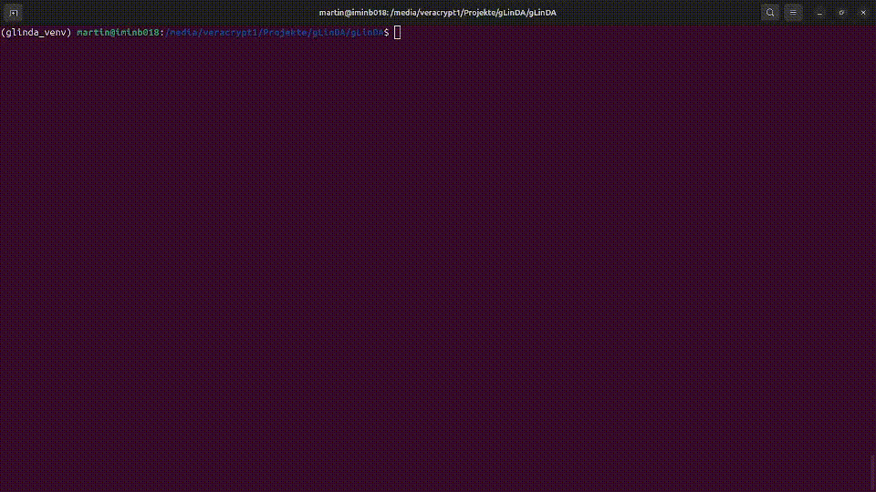
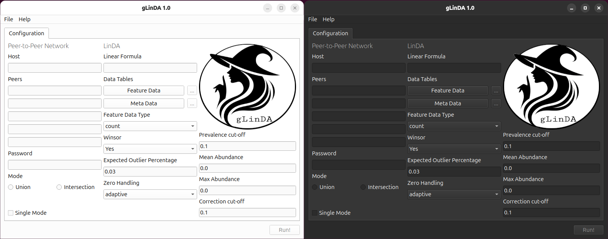
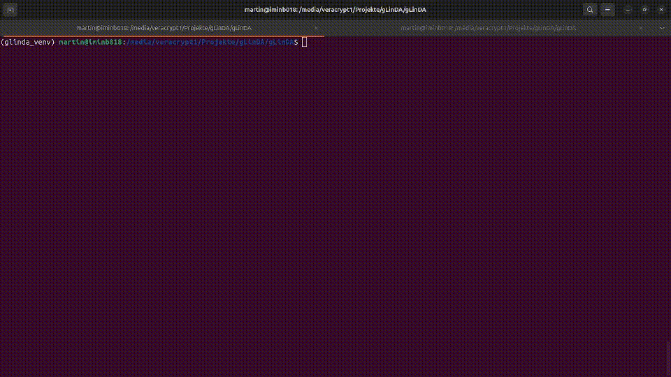

[](https://doi.org/10.5281/zenodo.13843588)

[TOC]

# gLinDA
gLinDA is a peer-to-peer swarm learning implementation of the differential abundance analysis tool LinDA, originally written in R.

## Installation
First, clone the repository and resolve all dependencies.

### Classical and Older Systems
```bash
git clone https://imigitlab.uni-muenster.de/published/glinda.git
cd glinda
pip install -r requirements.txt
```

### Newer Systems
Depending on your operating system, you need to create a virtual environment before installing the dependencies. [There are multiple solutions for that](https://packaging.python.org/en/latest/guides/installing-using-pip-and-virtual-environments/), but we will demonstrate how to do that with `python3-virtualenv`:

```bash
git clone https://imigitlab.uni-muenster.de/published/glinda.git
cd glinda
virtualenv glinda_venv
source glinda_venv/bin/activate
pip install -r requirements.txt
```

### Verify installation 
You can verify the successful installation by running the exemplary S-5000 dataset in solo mode. Just execute:
```bash
python glinda.py --config examples/s5000.ini
```

If you have to use a virtual environment, you have to activate that before with ``source glinda_venv/bin/activate`` in our example.


## Running
If you like to open the graphical user interface (GUI), just run
```bash
python gui.py
```


You can run also gLinDA GUI with a prepared configuration, just attach the configuration path:
```bash
python gui.py  --config examples/s5000.ini
```

## Appearance
gLinDA's appearance will adapt according to you operating system preference


The GUI provides only six slots for IP addresses, while using a configuration file without GUI via glinda.py does not have any limit.

## Testing
We provide the S-5000 dataset as a test dataset to allow easy testing.

You can run and test gLinDA in local (single) mode using our example configuration:

```bash
python glinda.py --config examples/s5000.ini
```

Additionally, we provide a script that splits one configuration file and the respective OTU and metadata tables into multiple files to simulate the behavior of single peers.

Using this command will produce two configuration files and two split (by default 50:50) fractions of the meta and OTU table into the `split` directory:
```bash
# mkdir splitted
python dataset_splitter.py -config examples/s5000.ini -p 2 -output split/
```

Now you can easily test now running twice (either GUI or terminal) glinda with the different configurations:
```bash
python glinda.py --config split/s5000_1.ini
```

and

```bash
python glinda.py --config split/s5000_2.ini
```

as recorded here (with ``gui.py`` instead of ``glinda.py``)

